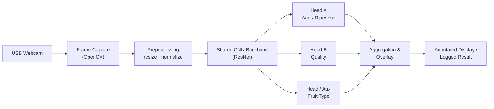

# Fruit Quality Detection

**A low-cost, edge-deployable computer-vision system for identifying the _age_ (ripeness) and _quality_ of common fruits — apple, banana, and orange — from a standard USB webcam feed.**

<p align="left">
  
  
  
  
  
</p>

> **Status:** Reconstruction of the work described in
> U. Kosta and S. Parmar, *"Fruit Classification Detection: A Low-Cost Model for Identifying Age and Quality of Specific Fruit Types,"* Proc. ICCET, 2023.
> The original source was rebuilt to modern engineering standards. The reported accuracy/throughput figures are **confirmed by the author** as consistent with the original work. They have not been independently re-run against the published paper PDF in this reconstruction; see [Results](#results).

---

## Table of Contents

- [Overview](#overview)
- [Motivation](#motivation)
- [Problem Statement](#problem-statement)
- [Features](#features)
- [System Architecture](#system-architecture)
- [Technology Stack](#technology-stack)
- [Repository Structure](#repository-structure)
- [Hardware Requirements](#hardware-requirements)
- [Software Requirements](#software-requirements)
- [Installation](#installation)
- [Usage](#usage)
- [Dataset](#dataset)
- [Model Design](#model-design)
- [Results](#results)
- [Limitations](#limitations)
- [Roadmap](#roadmap)
- [References](#references)
- [License](#license)
- [Author](#author)

---

## Overview

Fruit Quality Detection is an embedded machine-learning system that classifies a fruit's **type**, its **age/ripeness stage**, and its **quality (good vs. defective)** in real time from an ordinary USB webcam. It was designed to run on two low-cost single-board computers — the **NVIDIA Jetson Nano** and the **Raspberry Pi** — so that the accuracy/throughput trade-off of edge accelerators versus general-purpose SBCs could be compared directly on identical inputs.

The project pairs a single shared convolutional backbone (ResNet performed best among the architectures evaluated) with two lightweight classification heads, so a single forward pass yields both an age estimate and a quality verdict.

## Motivation

Manual sorting of fruit by ripeness and quality is labour-intensive, subjective, and hard to scale for small vendors, co-operatives, and low-budget agricultural settings. Commercial optical sorters exist but are expensive. The goal here was to show that a **usable classifier can run on sub-$100 hardware with a commodity webcam**, making automated quality assessment accessible where cost is the primary constraint.

## Problem Statement

Given a live camera frame containing a single fruit, the system must:

1. Identify the **fruit type** (apple, banana, orange).
2. Estimate its **age / ripeness stage**.
3. Judge its **quality** (good vs. defective/spoiled).

…all within a latency budget that supports interactive/real-time use on an edge device, without a network connection or cloud inference.

## Features

- **Multi-output inference** — fruit type, age, and quality from one model pass.
- **Two reference backends** — TensorFlow/Keras and PyTorch implementations of the same architecture.
- **Edge-ready** — runs on Jetson Nano and Raspberry Pi with a standard USB webcam.
- **Reproducible training pipeline** — configurable data loading, augmentation, training, and evaluation.
- **Real-time capture demo** — annotated live overlay from the webcam feed.
- **Comparative benchmarking** — scripts to measure accuracy and FPS per device.

## System Architecture



A more detailed data-flow and training-pipeline diagram is in [`diagrams/`](diagrams/) and [`docs/ARCHITECTURE.md`](docs/ARCHITECTURE.md).

## Technology Stack

| Layer            | Tools                                              |
|------------------|----------------------------------------------------|
| Language         | Python 3.9+                                         |
| DL frameworks    | TensorFlow / Keras, PyTorch                         |
| CV / IO          | OpenCV, NumPy, Pillow                               |
| Models evaluated | CNN (custom), RNN, **ResNet (best)**               |
| Edge targets     | NVIDIA Jetson Nano, Raspberry Pi                    |
| Camera           | Standard USB webcam (USB-A / USB-C, non-4K)         |
| Tooling          | pip / venv, pytest, GitHub Actions                  |

## Repository Structure

```
fruit-quality-detection/
├── README.md
├── LICENSE
├── CHANGELOG.md
├── CONTRIBUTING.md
├── SECURITY.md
├── CODE_OF_CONDUCT.md
├── requirements.txt
├── pyproject.toml
├── .gitignore
├── src/fruitqc/
│   ├── common/            # config, data, preprocessing, metrics (framework-agnostic)
│   ├── tensorflow/        # TF/Keras model + training
│   ├── pytorch/           # PyTorch model + training
│   └── realtime/          # webcam capture + live inference
├── docs/                  # architecture, hardware, install, usage guides
├── diagrams/              # Mermaid source diagrams
├── images/                # screenshots (placeholders) and figures
├── examples/              # runnable example scripts + sample config
├── scripts/               # training / benchmark entry points
├── tests/                 # unit tests
└── .github/               # CI workflows + issue templates
```

## Hardware Requirements

See [`docs/HARDWARE.md`](docs/HARDWARE.md) for the full bill of materials, wiring, and setup notes. In brief:

- NVIDIA Jetson Nano **or** Raspberry Pi (4 recommended)
- USB webcam (standard resolution; 4K/8K not required)
- 5 V power supply appropriate to the board
- microSD card (32 GB+), optional cooling

## Software Requirements

- Python 3.9 or newer
- TensorFlow 2.x and/or PyTorch 2.x
- OpenCV, NumPy, Pillow
- (Jetson) JetPack / L4T with CUDA; (Pi) 64-bit Raspberry Pi OS

Full details in [`docs/INSTALL.md`](docs/INSTALL.md).

## Installation

```bash
git clone https://github.com/Urvish-Kosta/fruit-quality-detection.git
cd fruit-quality-detection
python -m venv .venv && source .venv/bin/activate
pip install -r requirements.txt
```

Edge-device specifics (JetPack, Pi OS, camera permissions) are documented in [`docs/INSTALL.md`](docs/INSTALL.md).

## Usage

Train (TensorFlow backend):

```bash
python scripts/train.py --backend tensorflow --config examples/config.yaml
```

Evaluate:

```bash
python scripts/evaluate.py --backend tensorflow --weights runs/best.h5
```

Real-time webcam demo:

```bash
python scripts/realtime.py --backend tensorflow --weights runs/best.h5 --camera 0
```

Full walkthrough: [`docs/USAGE.md`](docs/USAGE.md).

## Dataset

Training data was sourced from public **Kaggle** fruit datasets covering apple, banana, and orange. Both pre-labelled ("classified") and unlabelled ("unclassified") subsets were used: after initial training on the labelled data, the model was retrained incorporating the additional data to improve robustness. Dataset preparation and the expected on-disk layout are described in [`docs/DATASET.md`](docs/DATASET.md).

> Datasets are **not** redistributed in this repository. Download links and licensing notes are in the dataset guide.

## Model Design

Three architectures were evaluated — a custom **CNN**, an **RNN**, and **ResNet**. ResNet gave the best results and is the default. The deployed model uses a shared backbone with separate heads for age and quality (multi-output), so both predictions come from a single inference pass. Design rationale is in [`docs/ARCHITECTURE.md`](docs/ARCHITECTURE.md).

## Results

Reported by the authors for the two edge targets:

| Device            | Accuracy | Throughput   | Notes                              |
|-------------------|----------|--------------|------------------------------------|
| NVIDIA Jetson Nano| ~79%     | ~60 FPS      | Best accuracy and throughput       |
| Raspberry Pi      | ~55%     | ~15–30 FPS   | General-purpose SBC, no GPU accel. |

> **Author-confirmed.** These figures are confirmed by the author as consistent with the original ICCET 2023 work. They have not been re-run on this reconstructed code, and no additional metrics have been invented — further cells are left for future measured runs on this codebase.

## Limitations

- Trained on three fruit types under dataset-typical lighting; unseen conditions may degrade accuracy.
- Single-fruit-per-frame assumption; no multi-object detection/localization.
- Raspberry Pi accuracy is materially lower than Jetson — the accuracy/cost trade-off is real.
- Reported metrics await re-verification (see above).

## Roadmap

See [`docs/ROADMAP.md`](docs/ROADMAP.md). Highlights: re-verify paper metrics, add multi-object detection, quantization/TensorRT for the Pi, expand fruit classes, add a confusion-matrix report to CI.

## References

1. U. Kosta and S. Parmar, "Fruit Classification Detection: A Low-Cost Model for Identifying Age and Quality of Specific Fruit Types," *Proc. ICCET*, 2023.
2. K. He, X. Zhang, S. Ren, J. Sun, "Deep Residual Learning for Image Recognition," *CVPR*, 2016.

## License

Released under the [MIT License](LICENSE).

## Author

**Urvish Kosta** — Embedded Systems & Digital Design Engineer
[LinkedIn](https://linkedin.com/in/urvishkosta) · [GitHub](https://github.com/Urvish-Kosta)
