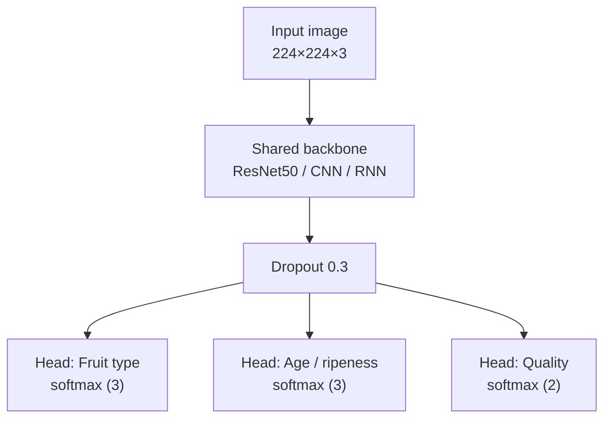
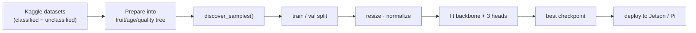
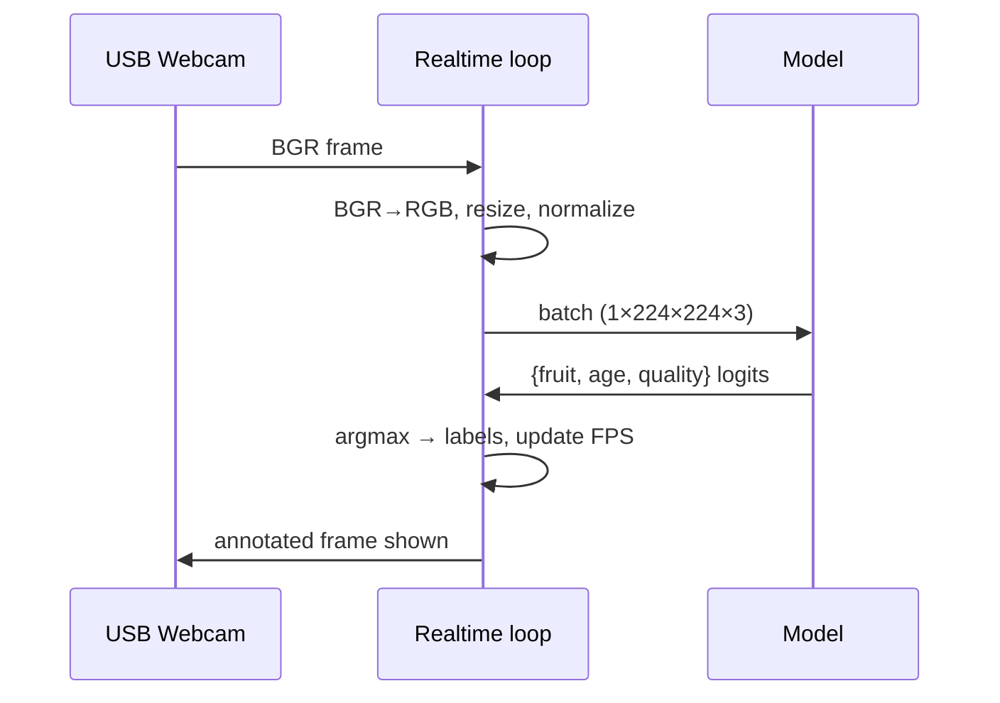

# Architecture

## Overview

Fruit Quality Detection uses a **single shared convolutional backbone** feeding
**three classification heads**. One forward pass produces fruit type, age/ripeness,
and quality — which keeps latency low on edge hardware, where running three
separate models would be wasteful.

## Backbone choice

The original study compared three backbones. They are all implemented so the
comparison is reproducible:

| Backbone | Role                    | Notes                                             |
|----------|-------------------------|---------------------------------------------------|
| ResNet50 | **Default / best**      | ImageNet-pretrained; strongest accuracy.          |
| CNN      | Lightweight baseline    | Small 3-block conv net; fast, lower accuracy.     |
| RNN      | Comparison only         | CNN feature extractor + GRU; included because the study evaluated it. A recurrent model on single still images is unconventional and is not expected to win — it exists for completeness. |

## Multi-output design rationale

Age and quality are modelled as **two separate heads on one backbone** (rather
than two independent models or one fused label) because:

- A single backbone amortizes feature extraction across all three predictions —
  critical for edge FPS.
- Separate heads keep the label spaces independent, so "ripe" × "defective" is
  representable without a combinatorial label explosion.
- It matches the low-cost, single-deployment goal of the project.

## Training data flow

## Inference on the edge

## Module map

| Module                         | Responsibility                                  |
|--------------------------------|-------------------------------------------------|
| `fruitqc.common.config`        | Label spaces, `TrainConfig`, YAML loading       |
| `fruitqc.common.preprocess`    | Resize + normalize (train/serve parity)         |
| `fruitqc.common.data`          | Dataset discovery from folder convention        |
| `fruitqc.tensorflow.model`     | Keras multi-output model                        |
| `fruitqc.tensorflow.train`     | `tf.data` pipeline + training loop              |
| `fruitqc.pytorch.model`        | Torch multi-output model                        |
| `fruitqc.pytorch.train`        | Dataset + training loop                         |
| `fruitqc.realtime.webcam`      | Backend-agnostic live inference loop            |
