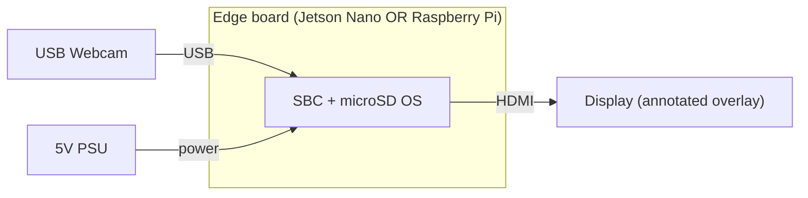

# Hardware Guide

This project was deployed and compared on **two** low-cost single-board
computers, both driven by a **standard USB webcam** (not 4K/8K).

## Bill of Materials

| # | Component                        | Notes                                              |
|---|----------------------------------|----------------------------------------------------|
| 1 | NVIDIA Jetson Nano Developer Kit  | GPU-accelerated edge target                        |
| 2 | Raspberry Pi (Pi 4 recommended)   | General-purpose SBC target                         |
| 3 | USB webcam                        | Standard resolution; USB-A or USB-C, non-4K        |
| 4 | microSD card (32 GB+)             | OS + model; UHS-I recommended                      |
| 5 | Power supply                      | Jetson: 5 V/4 A barrel or USB-C per revision; Pi: 5 V/3 A USB-C |
| 6 | Cooling (heatsink/fan)            | Recommended for Jetson under sustained inference   |
| 7 | (Optional) fruit staging surface  | Plain, evenly-lit background improves accuracy     |

> Exact webcam model is not pinned — any UVC-compliant USB camera enumerated by
> OpenCV should work. If you know the specific model used, add it here.

## Connection diagram

Because the camera is USB-UVC, there is **no GPIO wiring** required for the core
system — the webcam and power are the only connections. This is intentional:
part of the "low-cost / low-complexity" goal.

## Device comparison

| Aspect        | Jetson Nano                     | Raspberry Pi                     |
|---------------|---------------------------------|----------------------------------|
| Acceleration  | CUDA GPU                        | CPU only                         |
| Reported acc. | ~79%   | ~55%    |
| Reported FPS  | ~60    | ~15–30  |
| Best for      | Accuracy + throughput           | Lowest cost / availability       |

See the top-level README [Results](../README.md#results) for the verification
caveat on these numbers.

## Development environment

| Board        | OS / SDK                                    |
|--------------|---------------------------------------------|
| Jetson Nano  | JetPack / L4T with CUDA, cuDNN, TensorRT     |
| Raspberry Pi | 64-bit Raspberry Pi OS                       |

## Setup checklist

1. Flash the board OS to the microSD card and boot.
2. Connect the USB webcam; confirm it enumerates (`ls /dev/video*`).
3. Install software dependencies (see [INSTALL.md](INSTALL.md)).
4. Copy trained weights to the board.
5. Run the realtime demo (see [USAGE.md](USAGE.md)).
